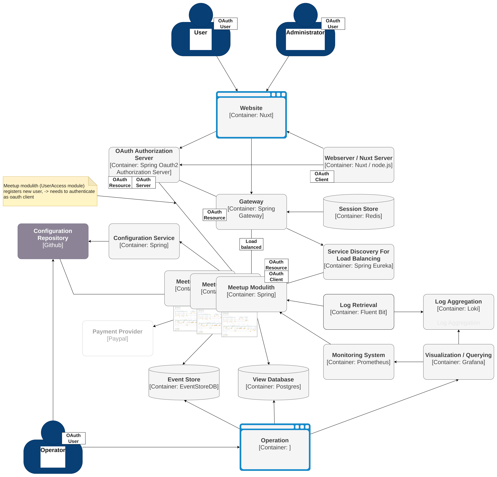
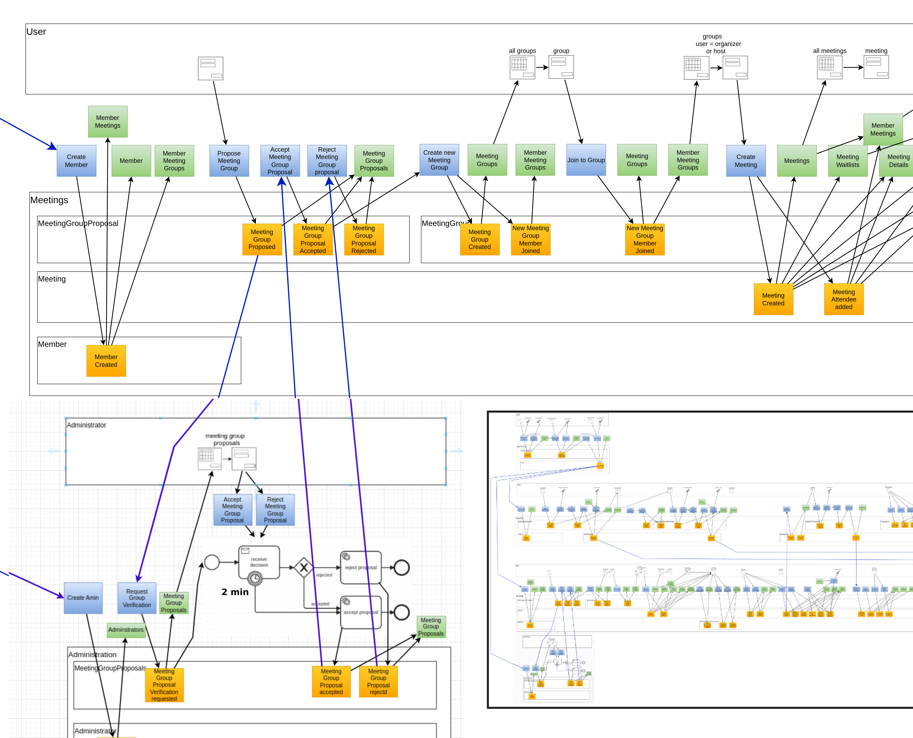
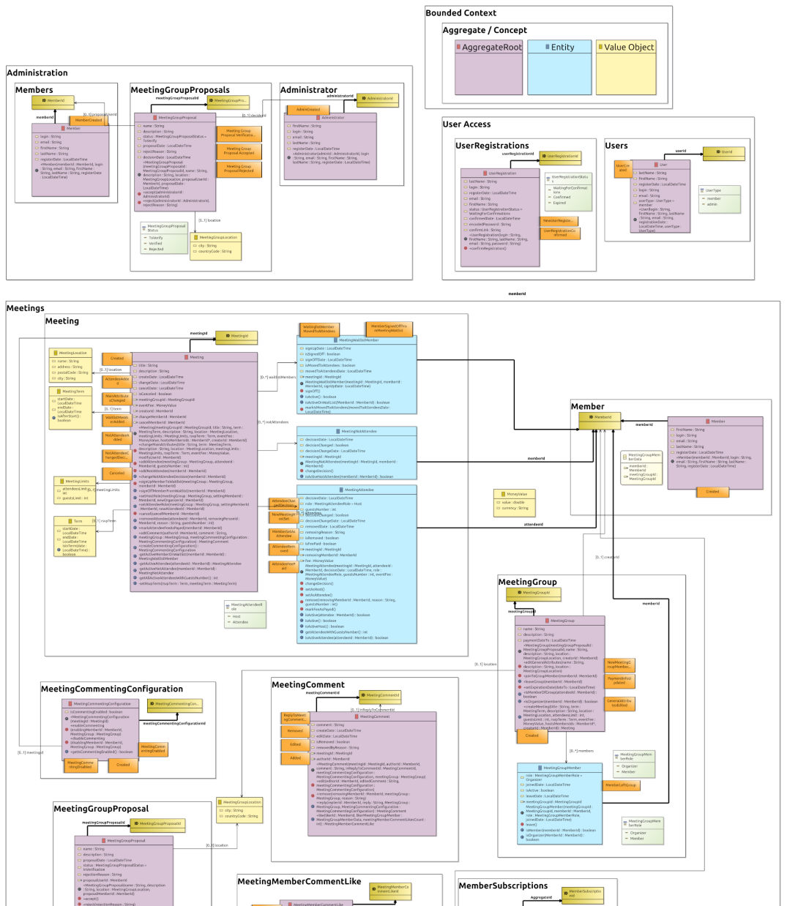

# Meetup

work in progress

inspired by / copied from:

[https://github.com/kgrzybek/modular-monolith-with-ddd](https://github.com/kgrzybek/modular-monolith-with-ddd)

## Techniques

### DDD
[https://www.domainlanguage.com/ddd/](https://www.domainlanguage.com/ddd/)

[Learning Domain-Driven Design](https://www.oreilly.com/library/view/learning-domain-driven-design/9781098100124/)

### CQRS with ES

[Martin Fowler - Event Driven](https://martinfowler.com/articles/201701-event-driven.html)

[Greg Young's CQRS documents](https://cqrs.wordpress.com/wp-content/uploads/2010/11/cqrs_documents.pdf)

### Event Modeling

[https://github.com/AxonIQ/hotel-demo/blob/master/Demo.pdf](https://github.com/AxonIQ/hotel-demo/blob/master/Demo.pdf)

[https://draft.io/customer-stories/axa-translate-business-needs-into-features-effectively-with-event-modeling](https://draft.io/customer-stories/axa-translate-business-needs-into-features-effectively-with-event-modeling)

### BPMN

[Camunda](https://www.camunda.com/)

### Cloud Native

[Cloud Native Spring in Action](https://www.manning.com/books/cloud-native-spring-in-action)

## Documentation

### Architecture

  

### Event Model

  

### Domain Model

  

### License

[MIT license](https://opensource.org/licenses/MIT)
